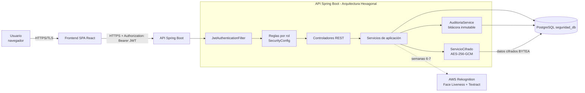

# Semana 1 – Arquitectura de seguridad

## Capas de defensa
1. **Transporte:** HTTPS/TLS (puerto 8443) con redirección desde HTTP.
2. **Autenticación:** login → JWT firmado (HS256) con vencimiento (60 min).
3. **Autorización:** RBAC por rol en `SecurityConfig` (401 sin token, 403 sin permiso).
4. **Contraseñas:** hash BCrypt (nunca texto plano).
5. **Datos en reposo:** AES-256-GCM (cifrado autenticado, IV aleatorio por dato).
6. **Trazabilidad:** bitácora de auditoría de solo-agregar (el repositorio no expone update/delete y la base ignora UPDATE/DELETE).

## Decisiones de diseño
* **Puerto `GeneradorToken`:** el servicio de login no conoce JWT; si mañana se cambia el mecanismo de tokens solo se reemplaza el adaptador `JwtService`.
* **Sesión sin estado:** no hay cookies de sesión, por eso CSRF está deshabilitado (la API solo acepta el token en el encabezado).
