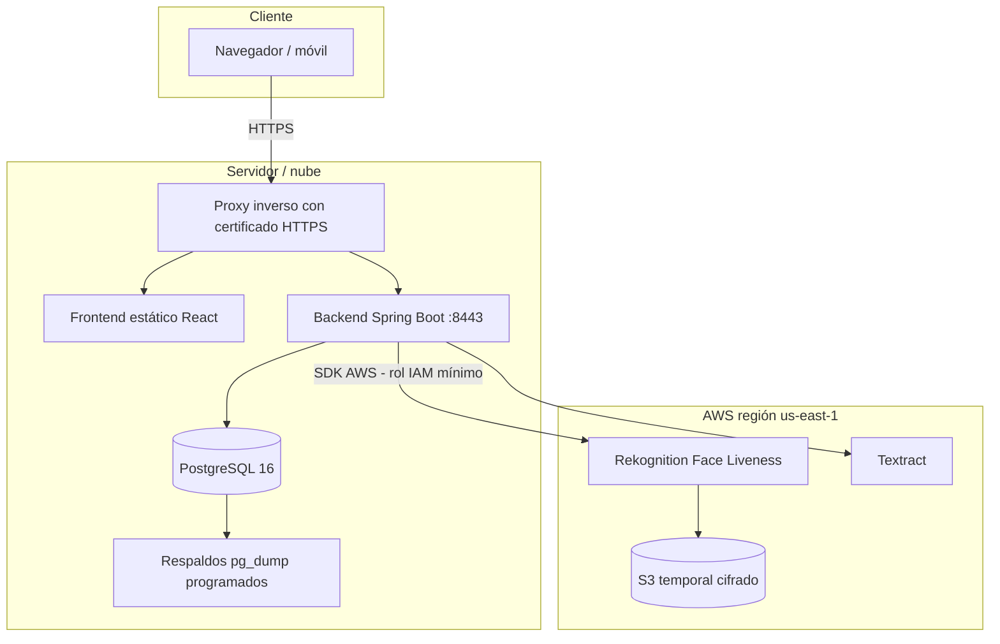

# Semana 1 – Infraestructura, despliegue y cuenta AWS

## Diagrama de infraestructura (despliegue en semana 12)

## Configuración de la cuenta AWS (guía)
1. Crear la cuenta en <https://aws.amazon.com> y activar **MFA** en el usuario raíz. No usar el usuario raíz para el proyecto.
2. En **IAM** crear el grupo `instrumentos-dev` y un usuario `app-instrumentos` (acceso programático).
3. Adjuntar solo las políticas necesarias (mínimo privilegio): `AmazonRekognitionFullAccess` o una política propia con
   `rekognition:CreateFaceLivenessSession`, `rekognition:GetFaceLivenessSessionResults` y `textract:AnalyzeID`.
4. Crear un **presupuesto (Budget)** con alerta de gasto para no exceder el crédito gratuito.
5. Guardar las credenciales en **variables de entorno** (`AWS_ACCESS_KEY_ID`, `AWS_SECRET_ACCESS_KEY`, `AWS_REGION`); nunca en el repositorio.
6. Elegir una región que soporte Face Liveness y Textract (por ejemplo `us-east-1`).

> La integración real con Rekognition y Textract se programa en las semanas 6 y 7.
