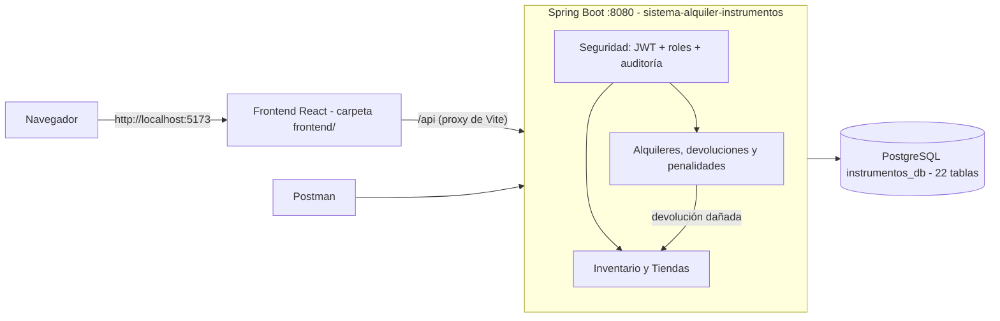

# Arquitectura del proyecto unido

Una sola aplicación **Spring Boot** (Arquitectura Hexagonal) con una sola base de datos **PostgreSQL** (`instrumentos_db`)
y un frontend **React** que la consume.



## Paquetes (`com.unifranz.sistemaalquilerinstrumentos`)
```
├── domain                      Entidades JPA y reglas puras (Haversine, penalidades)
│     Inventario: Instrumento, Tienda, Ciudad, Categoria, Subcategoria, Marca, Mantenimiento
│     Alquileres: Cliente, Alquiler, Devolucion, Penalidad, TarifaPenalidad
│     Seguridad:  Usuario, TipoUsuario, Permiso, IntentoFallido, BitacoraAuditoria
├── infrastructure
│   ├── persistence             Repositorios Spring Data
│   ├── security                JWT, filtro y reglas de acceso (SecurityConfig)
│   └── crypto                  Cifrado AES-256-GCM
├── application  (dto, service, port)   Casos de uso
├── web  (controller, exception)        API REST y errores en JSON
└── config                      Usuarios de demostración y redirección HTTPS
```

## Cómo se unieron los módulos
| Tema | Decisión |
|---|---|
| Base de datos | Una sola (`instrumentos_db`, la de Matías). Pasó de 7 a **22 tablas**. |
| Instrumentos en alquileres | La copia mínima `instrumentos_ref` de Leonardo se **eliminó**: `alquileres` apunta a la tabla real `instrumentos`. |
| Devolución con daños | Crea sola un registro en `mantenimientos` (con su `cod_devolucion`) y el instrumento pasa a EN MANTENIMIENTO. |
| Claves foráneas nuevas | `usuarios.cod_tienda`, `mantenimientos.id_usuario` y `mantenimientos.cod_devolucion` (con `NOT VALID`: no revisan datos viejos). |
| Seguridad | Spring Security protege toda la API (ver tabla de acceso). |
| CORS | Un solo lugar: `SecurityConfig` (localhost:3000 y 5173). |
| Puertos | Antes 8080/8082/8083; ahora **8080** para todo el backend. |

## Acceso por rol
| Recurso | Público | Cliente | Encargado | Administrador |
|---|:-:|:-:|:-:|:-:|
| `GET` catálogo: instrumentos, buscar, comparar, tiendas, categorías, marcas, ciudades, ping | ✔ | ✔ | ✔ | ✔ |
| `POST/PUT` instrumentos, mantenimientos | ✖ | ✖ | ✔ | ✔ |
| Clientes, alquileres, devoluciones, tarifas, historial | ✖ | ✖ | ✔ | ✔ |
| `POST /api/tiendas`, `/api/admin/**`, `/api/auditoria` | ✖ | ✖ | ✖ | ✔ |
