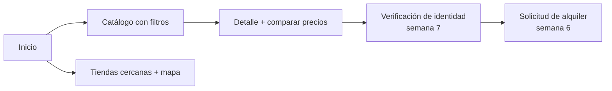

# Semana 1 – Wireframes del cliente

**Responsable:** Camila Alejandra Vargas Mamani · (se pasan a Figma como parte del sistema de diseño de la semana 2)

## Flujo del cliente


## 1. Catálogo
```
+--------------------------------------------------------------+
| 🎸 Sistema de Instrumentos     [Inicio][Catálogo][Tiendas]   |
+--------------------------------------------------------------+
| Catálogo de instrumentos                                     |
| [ Buscar........ ] [Categoría v] [Tipo v] [Ciudad v] [Limpiar]|
|                                                              |
| +------------+  +------------+  +------------+               |
| |DISPONIBLE  |  |DISPONIBLE  |  |DISPONIBLE  |               |
| |Guitarra    |  |Violín 4/4  |  |Charango    |               |
| |Yamaha C40  |  |Yamaha V3   |  |Artesanal   |               |
| |📍 Centro   |  |📍 Zona Sur |  |📍 El Alto  |               |
| |Bs 25 /día  |  |Bs 40 /día  |  |Bs 15 /día  |               |
| |[Ver detalle]| |[Ver detalle]| |[Ver detalle]|              |
| +------------+  +------------+  +------------+               |
+--------------------------------------------------------------+
```

## 2. Detalle de instrumento y comparación de precios
```
+--------------------------------------------------------------+
| ← Catálogo / INS-000001                                      |
| +---------------------------+  +---------------------------+ |
| | DISPONIBLE                |  | Comparar precios          | |
| | Guitarra acústica         |  | Tienda      Ciudad  Precio| |
| | Código / Marca / Modelo   |  | El Alto     El Alto  Bs 20| |
| | Tipo / Tienda             |  | Sopocachi   La Paz   Bs 22| |
| | Bs 25 /día                |  | Centro      La Paz   Bs 25| |
| | [Solicitar alquiler]      |  | Zona Sur    La Paz   Bs 30| |
| +---------------------------+  +---------------------------+ |
+--------------------------------------------------------------+
```

## 3. Mapa de tiendas cercanas
```
+--------------------------------------------------------------+
| Tiendas cercanas                                             |
| [Tipo de instrumento....]  [📍 Usar mi ubicación]            |
| +----------------------------------------------------------+ |
| |                MAPA (Leaflet / OpenStreetMap)            | |
| |        📍tienda      🔵 tú         📍tienda              | |
| +----------------------------------------------------------+ |
| +-----------+ +-----------+ +-----------+                    |
| |Centro     | |Sopocachi  | |El Alto    |  (ordenadas por    |
| |1.2 km     | |2.8 km     | |6.0 km     |   distancia)       |
| +-----------+ +-----------+ +-----------+                    |
+--------------------------------------------------------------+
```

## 4. Verificación de identidad (se construye en la semana 7)
```
 Consentimiento informado → Prueba de vida (cámara) → Foto del carnet → Datos autocompletados (editables) → Éxito / Error
```
