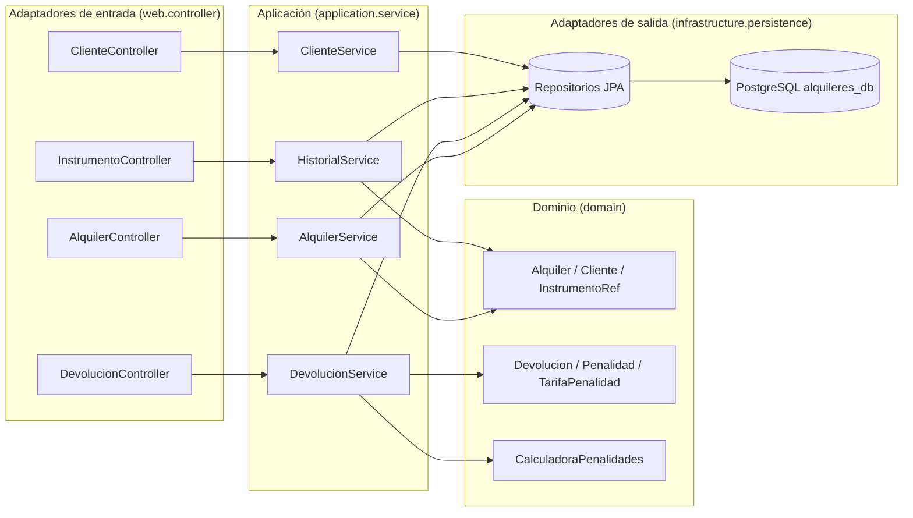

# Semana 1 – Diseño hexagonal del módulo de Alquileres

El **dominio** (Alquiler, Cliente, Devolucion, Penalidad y la regla `CalculadoraPenalidades`) no conoce
Spring ni la base de datos. Los casos de uso (servicios) lo orquestan y los adaptadores (REST y JPA) lo conectan con el exterior.



## Paquetes
```
com.unifranz.sistemaalquileresinstrumentos
├── domain                      entidades JPA, enums y CalculadoraPenalidades (regla pura)
├── infrastructure.persistence  repositorios Spring Data
├── application
│   ├── dto                     requests / responses
│   └── service                 casos de uso
├── web
│   ├── controller              API REST
│   └── exception               errores en JSON
└── config                      CORS para el frontend
```

## Integración futura
`InstrumentoRef` es una copia mínima del inventario. En la semana 10, al integrar con el módulo de Matías,
se reemplaza por una consulta al inventario real (la tabla `instrumentos`) sin tocar las reglas del dominio.
