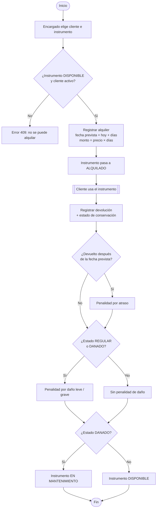

# Semana 1 – Diagrama de flujo del ciclo de alquiler

```mermaid
flowchart TD
    A([Inicio]) --> B[Encargado elige cliente e instrumento]
    B --> C{¿Instrumento DISPONIBLE<br/>y cliente activo?}
    C -- No --> X[Error 409: no se puede alquilar]
    C -- Sí --> D[Registrar alquiler<br/>fecha prevista = hoy + días<br/>monto = precio × días]
    D --> E[Instrumento pasa a ALQUILADO]
    E --> F[[Cliente usa el instrumento]]
    F --> G[Registrar devolución<br/>+ estado de conservación]
    G --> H{¿Devuelto después<br/>de la fecha prevista?}
    H -- Sí --> I[Penalidad por atraso]
    H -- No --> J{¿Estado REGULAR<br/>o DANADO?}
    I --> J
    J -- Sí --> K[Penalidad por daño leve / grave]
    J -- No --> L[Sin penalidad de daño]
    K --> M{¿Estado DANADO?}
    L --> M
    M -- Sí --> N[Instrumento EN MANTENIMIENTO]
    M -- No --> O[Instrumento DISPONIBLE]
    N --> P([Fin])
    O --> P
```
